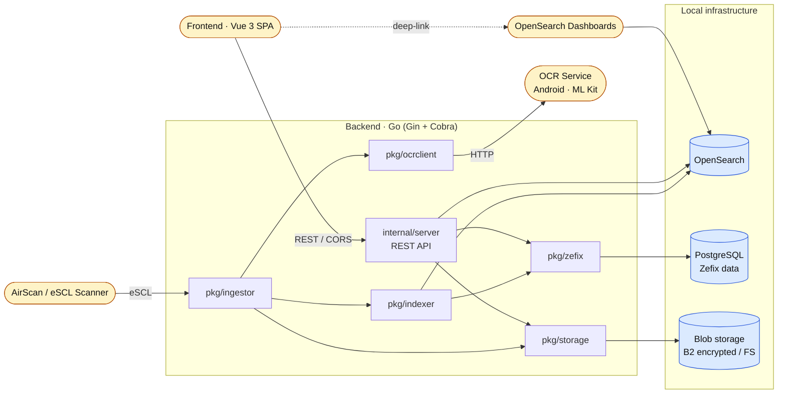

# ODI — Open Document Indexer

[](https://github.com/denysvitali/odi/actions/workflows/ci.yml)
[](https://github.com/denysvitali/odi/actions/workflows/images.yml)

**Privacy-first, self-hosted document digitization.** Scan paper documents with a network scanner, run OCR on a device you control, and full-text search the archive — no cloud services, no telemetry.

## Architecture

Two separate flows: an **ingestion pipeline** that pulls pages from a scanner and pushes them through OCR into search + storage, and a **query path** where the SPA talks exclusively to the backend's REST API.



Key points:

- **The frontend never talks to OpenSearch directly for data.** Searches, listing, and document fetches all go through the backend's REST API. OpenSearch Dashboards is only linked as a convenience "open in Dashboards" target.
- **OCR runs off-device, on-prem.** The backend POSTs images to an [ocr-server](https://github.com/denysvitali/ocr-server) running on an Android phone on the LAN — ML Kit performs OCR locally.
- **Blob storage is optional-encrypted.** The B2 backend uses AES-256-GCM with PBKDF2; the filesystem backend is plain and meant for use on an already-encrypted FUSE mount.
- **Company enrichment.** Extracted text is cross-referenced against a local Zefix (Swiss commercial register) PostgreSQL dump imported via `odi zefix-import`.

## Components

| Path | Language | Purpose |
|---|---|---|
| `main.go`, `internal/`, `pkg/` | Go | REST API, ingestion, indexing, OCR orchestration, storage |
| [`frontend/`](frontend/) | TypeScript · Vue 3 · Vite | Search UI, document viewer |
| [`zefix-tools/`](zefix-tools/) | Go | Legacy standalone Zefix CLIs (the same functionality is exposed by `odi zefix-import` / `odi zefix-find`) |

Published container images (on every push to `main` and on tags):

- `ghcr.io/denysvitali/odi` (backend)
- `ghcr.io/denysvitali/odi-frontend`

The Helm chart lives in a separate repository.

## Prerequisites

| Tool | Purpose |
|---|---|
| Go 1.26+ | Backend build / tests |
| pnpm | Frontend build |
| Docker + Compose | OpenSearch, OpenSearch Dashboards, PostgreSQL |
| [ocr-server](https://github.com/denysvitali/ocr-server) | Android ML Kit OCR endpoint reachable from the backend |
| AirScan / eSCL scanner | Live scanning (optional — you can also index from a directory) |

## Quick Start

```bash
# 1. Configure shared secrets
cp .env.example .env
$EDITOR .env            # at minimum set OPENSEARCH_ADMIN_PASSWORD and POSTGRES_PASSWORD

# 2. Bring up infrastructure (OpenSearch, Dashboards, PostgreSQL)
make docker-up

# 3. Build everything (Go binary + frontend bundle)
make build

# 4. Import the Zefix register (optional — enables company matching)
#    See zefix-tools/README.md or run `go run . zefix-import --help`.

# 5. Run the API
go run . serve

# 6. Index existing material
go run . index /path/to/scans    # image directory
go run . pdf   /path/to/pdfs     # PDFs

# 7. Run the frontend
cd frontend && pnpm install && pnpm run dev
```

The SPA loads runtime settings from `frontend/public/settings.json` (or `settings.json.tpl` in Docker). It needs two values: `apiUrl` (backend REST) and `opensearchUrl` (OpenSearch Dashboards, for deep links only).

## CLI

The Go binary (`odi`, or `go run .`) is a single Cobra CLI:

| Command | What it does |
|---|---|
| `serve` | Start the REST API |
| `ingest` | Live-scan from an AirScan scanner through the full pipeline |
| `index <dir>` | Index an existing directory of images |
| `pdf <dir>` | Index a directory of PDFs |
| `reindex` | Re-run indexing against existing blobs |
| `ocr` / `ocrtext` | Run OCR and extract text only |
| `decrypt` | Decrypt a stored encrypted blob |
| `zefix-import` | Import a Zefix JSON dump into PostgreSQL |
| `zefix-find` | Look up a company by name in the local Zefix database |
| `version` | Show the build version |

## Make Targets

```text
make build        Build the Go binary and the frontend bundle
make test         go test ./... + pnpm test
make lint         golangci-lint + pnpm lint
make ci-fail      Show latest failed CI run and top error lines (frontend-first)
make docker-up    Start OpenSearch + Dashboards + PostgreSQL
make docker-down  Stop all containers
```

## Repository Layout

```text
odi/
├── main.go               CLI entry point
├── internal/             cli/ (Cobra commands) + server/ (Gin REST API)
├── pkg/                  indexer, ingestor, ocrclient, storage, zefix, crypt, ...
├── frontend/             Vue 3 + Vite SPA
├── zefix-tools/          Legacy standalone Zefix CLIs (kept for reference)
├── docker-compose.yml    OpenSearch, Dashboards, PostgreSQL
├── Makefile              Unified build/test/lint targets
├── Dockerfile            Distroless backend image
└── renovate.json         Grouped dependency updates
```

## Configuration

The backend is fully env-driven. See [`.env.example`](.env.example) for the complete list — the essentials:

| Variable | Purpose |
|---|---|
| `OPENSEARCH_ADDR` / `_USERNAME` / `_PASSWORD` / `_SKIP_TLS` / `_INDEX` | OpenSearch connection |
| `STORAGE_TYPE` | `b2` or `filesystem` |
| `B2_ACCOUNT` / `B2_KEY` / `B2_BUCKET_NAME` / `B2_PASSPHRASE` | Backblaze B2 (encrypted) |
| `FS_PATH` | Filesystem storage root |
| `OCR_API_ADDR` / `OCR_API_CA_PATH` | OCR service |
| `ZEFIX_DSN` | PostgreSQL DSN for Zefix lookups |
| `SCANNER_NAME` | AirScan hostname |
| `CORS_ALLOWED_ORIGINS` | Frontend origins (default `http://localhost:5173`) |
| `API_TOKEN` | Optional bearer token (see below) |
| `TLS_CERT_PATH` / `TLS_KEY_PATH` | Optional inline TLS termination |
| `LOG_LEVEL` | `debug` / `info` / `warn` / `error` |

Values prefixed with `keychain:` are looked up via the OS keychain (e.g. `B2_KEY=keychain:b2-key`).

### Authentication

Set `API_TOKEN=<random-secret>` to require bearer-token auth on all `/api/v1/*` routes. Clients must then send `Authorization: Bearer <random-secret>` on every request. If `API_TOKEN` is unset, the server runs unauthenticated — only safe for local development.

## Privacy

- **OCR on hardware you own.** No document ever leaves the LAN during processing.
- **Encrypted at rest on B2.** AES-256-GCM with a key derived from your passphrase.
- **Local search index.** OpenSearch runs in Docker on your box.
- **No telemetry.** The backend and frontend do not phone home.

> ⚠️ The current B2 crypt scheme uses a single per-bucket key — sufficient for personal archives, not audited, and rotation is manual. Use the filesystem backend on a FUSE-encrypted mount if you need something you trust more.

## License

MIT. See [`LICENSE.txt`](LICENSE.txt) (where present) and [`frontend/LICENSE.txt`](frontend/LICENSE.txt).

Security reports → the address on [denv.it](https://denv.it).
